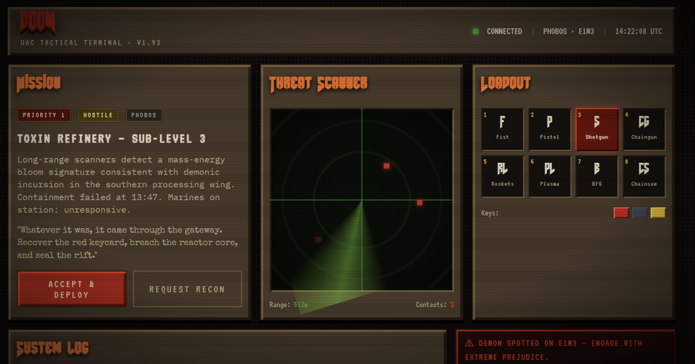
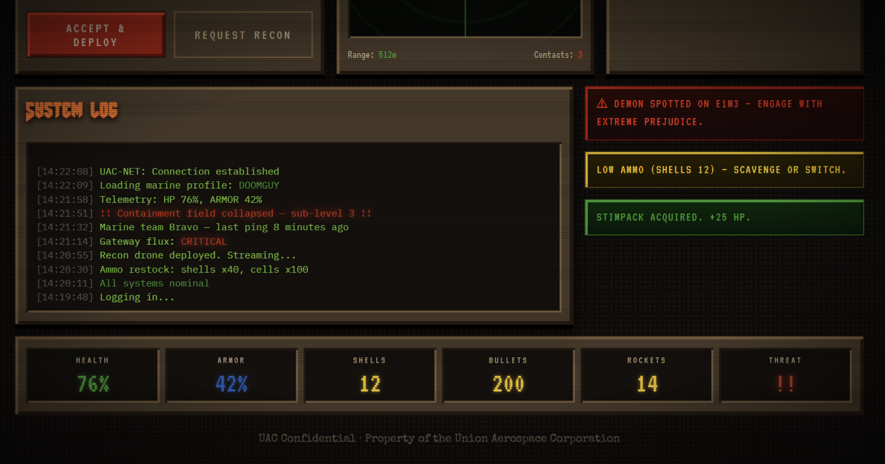
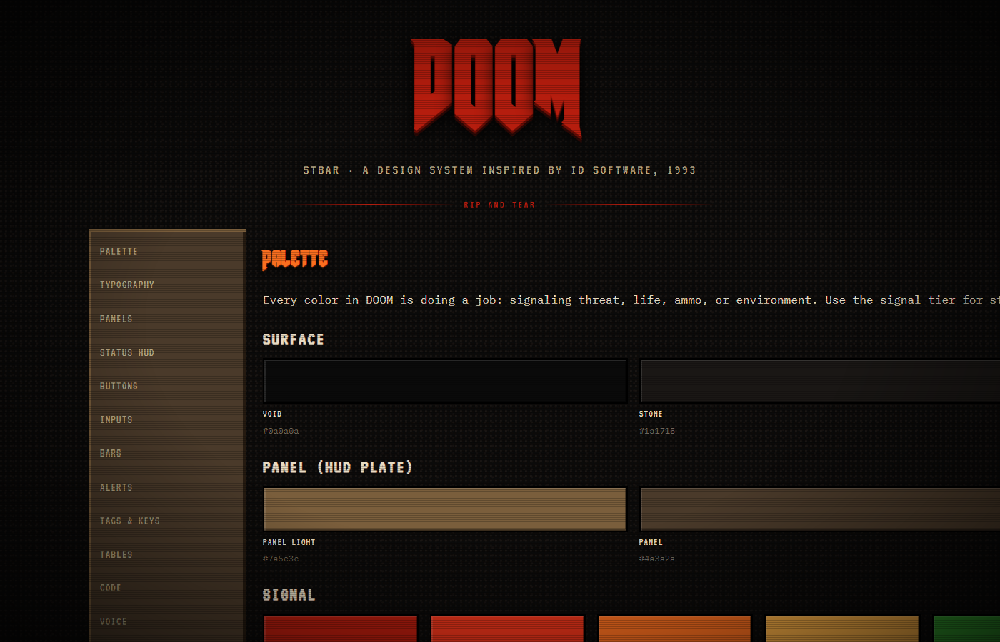
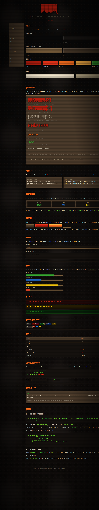

# STBAR

A hard-authentic design system inspired by id Software's *DOOM* (1993).
For websites, web apps, Tauri apps, and TUIs.

**[► View it live](https://YOUR-USERNAME.github.io/stbar/)** — the landing page, style guide, and demo all running with the full STBAR styling (scanlines, bevels, AmazDooM logo, and all).

> Named for `STBAR` — the lump in the original DOOM WAD that contains the
> status-bar graphic. It's the brown beveled HUD plate this whole system
> is built around.

> **Not affiliated with or endorsed by id Software, ZeniMax Media, Bethesda
> Softworks, or Microsoft.** DOOM is a registered trademark of ZeniMax Media
> Inc. This is an independent, fan-made design system inspired by the visual
> language of the 1993 game. No original game assets — sprites, sounds, art,
> or logo images — are reproduced or distributed in this repository.

## Screenshots

A sample interface (UAC tactical terminal) built end-to-end with STBAR — this is `demo.html` rendered in a browser.





Scanlines, vignette, bevels, glow, and the alternating-bevel DOOM logo are all CSS — nothing is a static image. The full component catalog is at the bottom of this README.

## What's in here

| File | What it is |
|---|---|
| `doom.css` | Drop-in stylesheet. CSS variables + utility classes (panels, buttons, HUD, bars, alerts, scanlines). |
| `amazdoom/` | Six AmazDooM TTF faces by Amazingmax. Bundled — see [`FONTS.md`](FONTS.md) for attribution. |
| `style-guide.html` | Living, interactive style guide. Open it in a browser to browse every component and token. |
| `demo.html` | Full sample interface — a UAC tactical terminal — showing the system end-to-end. |
| `doom-tui.md` | ANSI 256 color map, box-drawing patterns, ratatui/rich/lipgloss snippets for terminal UIs. |
| `STBAR-Style-Guide.docx` | Printable/shareable written guide with palette swatches, type rules, and do/don'ts. |
| `FONTS.md` | Font attribution and license details. |
| `LICENSE` | MIT — covers the code, docs, and stylesheets authored here. |
| `index.html` | Landing page served by GitHub Pages at the repo root. Links to the style guide and demo. |
| `screenshots/` | Renders of `demo.html` and `style-guide.html` used in this README. |

## Quick start

Clone the repo, then in any HTML file:

```html
<link href="https://fonts.googleapis.com/css2?family=Black+Ops+One&family=Rubik+Mono+One&family=VT323&family=Press+Start+2P&family=Special+Elite&family=IBM+Plex+Mono:wght@400;500;700&display=swap" rel="stylesheet">
<link rel="stylesheet" href="doom.css">

<body class="doom-scanlines doom-vignette">
  <div class="doom-container">
    <h1 class="doom-logo">
      <span>D</span><span class="alt">O</span><span>O</span><span class="alt">M</span>
    </h1>
    <div class="doom-panel">...</div>
    <button class="doom-btn doom-btn--blood">Engage</button>
  </div>
</body>
```

Keep the `amazdoom/` folder next to `doom.css` and the `@font-face` rules
will resolve automatically.

## Five rules

1. **No rounded corners.** Anywhere. Ever.
2. **Bevels:** highlight top + left, shadow bottom + right. Invert for "pressed in" surfaces.
3. **Type is monospaced.** Body in IBM Plex Mono, HUD in Press Start 2P, labels in VT323, logo in AmazDooM.
4. **Color is signal:** marine-green = healthy, armor-blue = info, key-yellow = warning, blood-bright = critical.
5. **When in doubt:** ask whether it would fit on a UAC monitor in 2145.

## Credits

Big thanks to **Amazingmax** for creating the AmazDooM font family and
releasing it free for personal and commercial use. The AmazDooM pack is
what gives this system its headline look. Source:
<https://fontmeme.com/fonts/amazdoom-font/>.

Google Fonts ships VT323, Press Start 2P, Special Elite, IBM Plex Mono,
Black Ops One, and Rubik Mono One under the SIL Open Font License — credit
to their respective designers (Peter Hull, CodeMan38, Astigmatic, IBM,
Sorkin Type, and Hubert & Fischer).

And of course, the visual language being honored here belongs to **id
Software** — John Carmack, John Romero, Adrian Carmack, Tom Hall, Sandy
Petersen, Kevin Cloud, and the rest of the 1993 team who built DOOM.

## License

The code, stylesheets, HTML pages, documentation, and written guides
authored here are licensed under the **MIT License** — see [`LICENSE`](LICENSE).
You can use them freely in personal and commercial projects.

The bundled AmazDooM font pack has its own license (Free per the
fontmeme.com listing, including commercial use) — see [`FONTS.md`](FONTS.md).
No DOOM-branded assets from id Software / ZeniMax are included.

## Why this isn't called "DOOM Style"

The project goes by **STBAR** — the WAD lump name — rather than "DOOM"
because DOOM is a registered trademark of ZeniMax Media. ZeniMax has
historically tolerated fan creations on GitHub (`doom-emacs` and many
others run unbothered), but using a distinctive non-trademark name keeps
the project searchable, easier to recommend, and zero-risk on the
trademark side. The inspiration is acknowledged in prose throughout this
README and in `FONTS.md`. None of this is legal advice — when in doubt,
talk to a lawyer.

---

## The component catalog — `style-guide.html`

The living style guide. Hero view first; the full-page render with every component, swatch, and type specimen is below it (collapsed by default — it's a long page).



<details>
<summary><strong>Full style-guide.html render</strong> (click to expand — large image)</summary>

<br>



</details>
